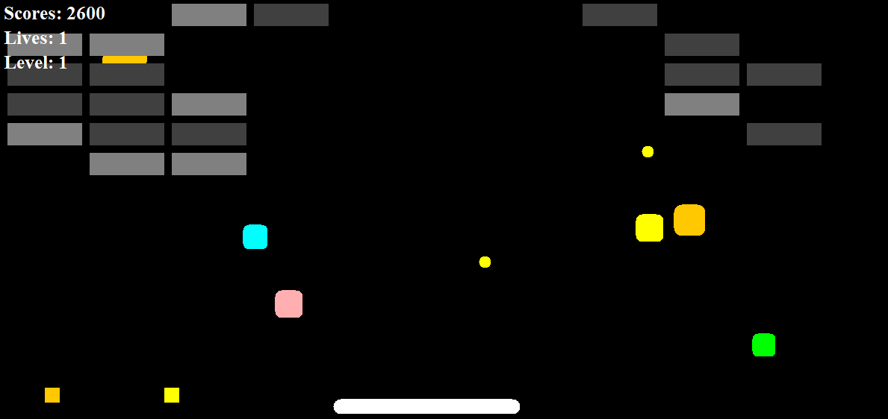

# Arkanoid Game in Java
## Author: Walerij Hrul

### Under the game
* Java
* Swing
* MVC pattern
* Unit tests

### How to launch the game?
1. download Arkanoid.jar file
2. double click on Arkanoid.jar 
    (alternatively - type in command line *java -jar Arkanoid.jar* and pressed Enter within the folder with Arkanoid.jar file)

### How to play?
1. Use arrow symbols (left, right, up, down) and enter to control the game
2. Use enter to make a ball movable after level's starting
3. Pick up bonuses and destroy bricks by hitting them with the ball
4. Bricks' destroying will bring you scores 
5. Destroy all of bricks to complete the level
6. Press escape if you want to pause the game

